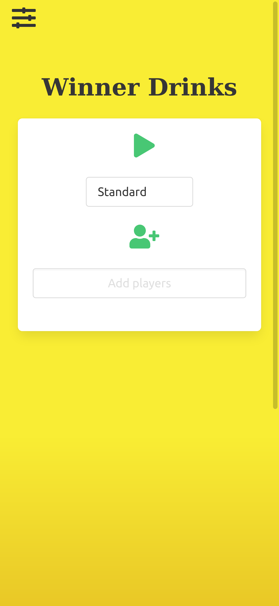
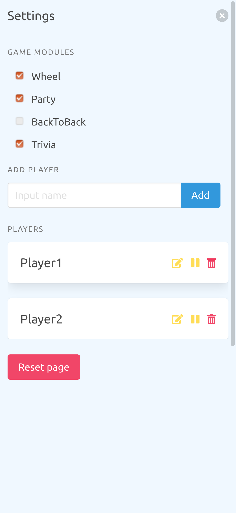
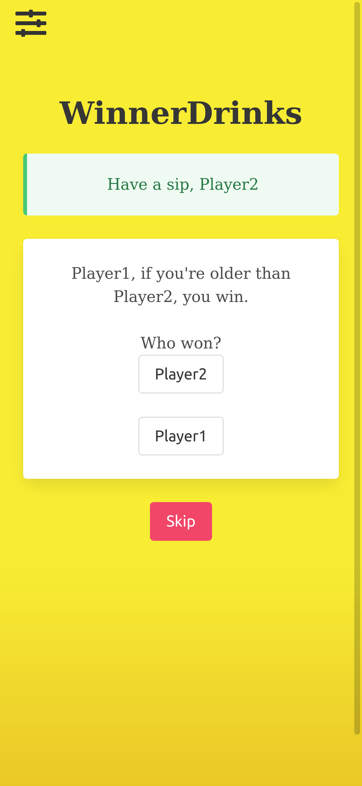

# WinnerDrinks

Live demo of the application can be found at [winner-drinks.xyz](https://winner-drinks.xyz/)

## About

This is the complete repository for the WinnerDrinks application.

You'll find the client side code built using React/TypeScript in the directory *client* and the server side code in the directory *server*. 


<!-- GETTING STARTED -->
## ⚡️ Getting Started

### Prerequisites

Make sure to have the following installed:

* [Node.js](https://nodejs.org/en/) (version <= 14.15.4)

* 🐳 [Docker](https://docs.docker.com/get-docker/) (version <= 20.10.3)

* [Docker-compose](https://docs.docker.com/compose/install/) (version <= 14.15.4)

#### For remote deployment:

* [Ansible](https://docs.ansible.com/ansible/latest/installation_guide/intro_installation.html) (version <= 2.9.6)

* [Python](https://www.python.org/downloads/) (version <= 3.8.5)

### Installation

1. Install NPM packages
  ```sh
  npm install
  ```

2. Start mongodb Docker container
  ```sh
  docker-compose -f ./dist/docker/docker-compose.yaml up
  ```

3. Start the application locally
  * Alt 1 - Start and initialize data
    ```sh
      npm start:dev:init
    ```
  * Alt 2 - Start <strong>without</strong> initialize data
    ```sh
      npm start:dev
    ```

4. Open [localhost](http://localhost:3000/) on port 3000 in your web-browser and start using the application.


## Deployment

### Build and deploy app for production


```
cd dist
```

```
./deploy_app_remote.sh <path_to_ssh_key> <public_ip_addres_machine_1> <public_ip_addres_machine_2> <public_ip_addres_machine_3>
```

Open [winner-drinks.xyz](https://winner-drinks.xyz) (OBS! Can take some minute). 

🔔 Please note: Application is cached and you may have to:

* Unregister Service Worker
* Delete cached storage
* Delete indexedDB 
* Reload the page to get the latest update visible. 


### Build and deploy for local production, for testing of Service Workers and IndexedDB etc

```
cd dist
```

```
./deploy_app_local.sh
```

Open localhost:4000 on your computer, obs can take some minute.

## Screenshots

<!--  -->




## Contributors ✨

<div style="displat: flex;">
  <a href="https://github.com/Lennca"></a>
  <a href="https://github.com/Martelleur"></a>
  <a href="https://github.com/delsehi"></a>
  <a href="https://github.com/SusannaP2018"></a>
  <a href="https://github.com/lucasj96"></a>
</div>